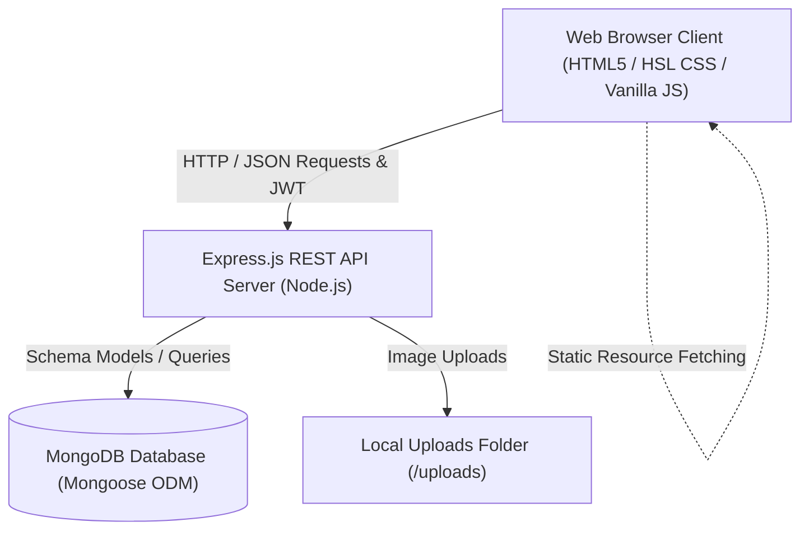

# Florish - Premium Floral E-Commerce Website: Project Analysis

This document provides a comprehensive technical overview and architectural breakdown of the **Florish** E-Commerce platform. It serves as a developer guide and system documentation for academic submission or project handoff.

---

## 📐 Architecture & System Design

Florish is built on a **decoupled full-stack architecture**, separating the client-side user interface from the server-side API business logic.



### 1. Presentation Layer (Frontend Client)
* **Architecture**: SPA-like dynamic template rendering utilizing pure Vanilla HTML5, modern HSL-based CSS3 custom properties, and modular JavaScript fetch clients.
* **Component Loader**: Reusable components (e.g., [navbar.html](file:///d:/finalProject/frontend/components/navbar.html), [footer.html](file:///d:/finalProject/frontend/components/footer.html), and loaders) are loaded dynamically using asynchronous fetches.
* **State Management**: Authentication sessions (tokens/user profiles) and cart/wishlist buffers are managed in client `localStorage` and synchronized with the backend.

### 2. Service Layer (Backend REST API)
* **Framework**: Node.js and Express.js REST API.
* **Security & Routing**: Secured via JSON Web Tokens (JWT) inside request headers, guarded by Express middleware, and hardened with CORS restrictions and Helmet security headers.
* **File Uploads**: Handled locally via Multer, routing graphic media directly into the `/uploads` directory.

### 3. Data Layer (Database)
* **Database**: MongoDB database.
* **ODM Layer**: Mongoose schemas map collections, validate constraints, and manage relation aggregates.

---

## 📂 Codebase & Directory Structure

```text
d:/finalProject/
├── backend/                       # REST API Backend Server
│   ├── config/                    # Database connections and configurations
│   ├── controllers/               # Route controller logic
│   ├── middleware/                # JWT verification & error interceptors
│   ├── models/                    # Mongoose Database schemas
│   ├── routes/                    # API Routing endpoints
│   ├── utils/                     # JWT signing & helper files
│   ├── package.json               # Backend Node dependencies
│   ├── seeder.js                  # Automated seeder tool
│   └── server.js                  # Main server entrypoint
│
├── frontend/                      # Web Client Assets
│   ├── admin/                     # Dashboard interfaces and admin controls
│   ├── css/                       # HSL stylesheets
│   ├── js/                        # Modular fetch clients & layout managers
│   ├── components/                # Reusable HTML template snippets
│   └── index.html                 # Homepage client view
│
├── database/                      # DB Schemas & Sample Seed Files
│   ├── mongodb-schema.txt         # Field types, validators, and database keys
│   └── sample-data.json           # Sample categories, users, & arrangements
│
└── documentation/                 # Academic deliverables (ER, DFD, SRS)
```

---

## 🗄️ Database Schemas & Collections

Detailed data models are defined in [database/mongodb-schema.txt](file:///d:/finalProject/database/mongodb-schema.txt) and coded in [backend/models/](file:///d:/finalProject/backend/models):

### 1. User Collection (`users`) - [User.js](file:///d:/finalProject/backend/models/User.js)
Tracks registration accounts, permissions, and roles.
* `_id` (ObjectId): Primary Key
* `name` (String): Required, trimmed
* `email` (String): Required, unique, validated email string
* `password` (String): Min 6 chars, hashed with Bcrypt
* `role` (String): Enum `['user', 'admin']`, defaults to `user`

### 2. Product Collection (`products`) - [Product.js](file:///d:/finalProject/backend/models/Product.js)
Stores floral inventory catalog details.
* `_id` (ObjectId): Primary key
* `name` (String): Required, unique
* `sku` (String): Unique identifiers (e.g. `FL-ROSE-09`)
* `category` (String): Enum `['bouquets', 'roses', 'indoor', 'lilies']`
* `price` (Number): Required base price
* `oldPrice` (Number): Prior price (supports discount calculations)
* `stock` (Number): Quantity, defaults to 10
* `rating` / `reviewsCount`: Double precision fields tracking feedback

### 3. Cart Collection (`carts`) - [Cart.js](file:///d:/finalProject/backend/models/Cart.js)
Maintains persistent cart contents synced with accounts.
* `user` (ObjectId): Relation key linking `User`
* `items`: Subdocument array of `product` (ObjectId reference) and `quantity` (Number)

### 4. Order Collection (`orders`) - [Order.js](file:///d:/finalProject/backend/models/Order.js)
Tracks user orders and shipping status.
* `user` (ObjectId): Relation key linking `User`
* `items`: Embedded snapshot array containing `product`, `name`, `price`, and `quantity`
* `shippingAddress`: Details containing customer names, physical addresses, and contact parameters
* `paymentMethod`: Enum `['cod', 'online']`
* `paymentStatus`: Enum `['pending', 'paid', 'failed']`
* `orderStatus`: Enum `['Processing', 'Shipped', 'Delivered', 'Cancelled']`

### 5. Wishlist Collection (`wishlists`) - [Wishlist.js](file:///d:/finalProject/backend/models/Wishlist.js)
Maintains lists of user favorite products.
* `user` (ObjectId): Unique relation key linking `User`
* `products`: Array of product ObjectIds

### 6. Review Collection (`reviews`) - [Review.js](file:///d:/finalProject/backend/models/Review.js)
Provides catalog feedback comments and ratings.
* `product` / `user`: Relation references
* `rating` (Number): Scale of 1 to 5
* `comment` (String): Required text
* *Constraint*: Compound index `{ product: 1, user: 1 }` guarantees only one review per customer per product.

---

## 🔗 Key API Route Mappings

All routing endpoints are registered in [backend/server.js](file:///d:/finalProject/backend/server.js):

| Endpoint | HTTP Method | Controller Function | Access Control |
| :--- | :--- | :--- | :--- |
| `/api/auth/register` | `POST` | User registration | Public |
| `/api/auth/login` | `POST` | User authentication | Public |
| `/api/products` | `GET` | [getProducts](file:///d:/finalProject/backend/controllers/productController.js#L14) (Query filters) | Public |
| `/api/products/:id` | `GET` | [getProductById](file:///d:/finalProject/backend/controllers/productController.js#L52) | Public |
| `/api/products/:id/reviews`| `POST` | [createProductReview](file:///d:/finalProject/backend/controllers/productController.js#L76) | Private |
| `/api/cart` | `GET`/`PUT` | Get or update cart data | Private |
| `/api/orders` | `POST` | Submit checkout order | Private |
| `/api/admin/dashboard-stats`| `GET` | [getDashboardStats](file:///d:/finalProject/backend/controllers/adminController.js#L48) | Private/Admin |
| `/api/admin/products` | `POST` | [addProduct](file:///d:/finalProject/backend/controllers/adminController.js#L15) | Private/Admin |
| `/api/admin/orders/:id/status`| `PUT`| [updateOrderStatus](file:///d:/finalProject/backend/controllers/adminController.js#L75) | Private/Admin |

---

## 🛠️ Installation, Configuration, & Seeding

### 1. Prerequisites
* **Node.js** (v16+) installed.
* **MongoDB Community Server** installed and running on default port `27017` locally, or a remote cloud cluster hosted on MongoDB Atlas.

### 2. Server Configuration
Create a `.env` file in [backend/](file:///d:/finalProject/backend) using [backend/.env.example](file:///d:/finalProject/backend/.env.example) as a guide:
```ini
PORT=5000
MONGO_URI=mongodb://127.0.0.1:27017/florish
JWT_SECRET=anyLongRandomKeyForTokens
JWT_EXPIRE=30d
```

### 3. Database Initialization (Seeding)
A database seeder [backend/seeder.js](file:///d:/finalProject/backend/seeder.js) has been provided to purge old data and import default products and test profiles:
```bash
# Navigate to backend folder
cd backend

# Install dependencies
npm install

# Run database import seeding command
npm run data:import
```
*(Use `npm run data:destroy` if you wish to clear all database collections.)*

### 4. Running the Project
```bash
# Run server in development mode (using nodemon)
npm run dev
```
Open [frontend/index.html](file:///d:/finalProject/frontend/index.html) in your browser (preferably via VS Code Live Server or a similar HTTP server extension).

---

## 🔑 Default Test Profiles (Configured in Seeder)

* **Administrator Profile**:
  * **Email**: `admin@florish.com`
  * **Password**: `admin123`
  * **Role**: Admin (Grants access to inventory edits, user listings, and order dispatch tracking dashboards).
* **Standard Customer Profile**:
  * **Email**: `jane@gmail.com`
  * **Password**: `user123`
  * **Role**: User (Grants access to catalog items, persistent carts, and order checkout tracking).
